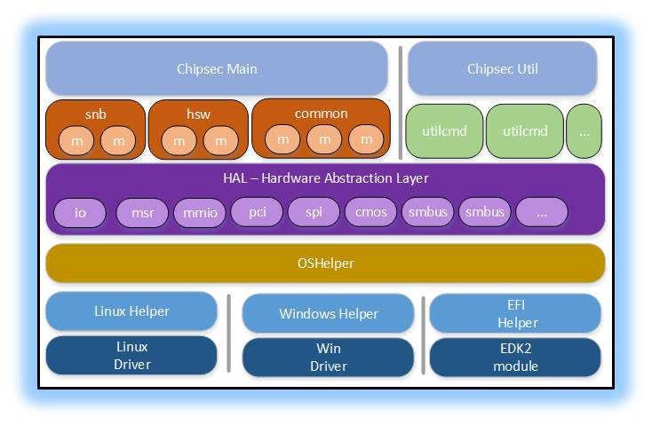

CHIPSEC Components and Structure
================================

   
Core components
---------------

    ===============================================  =================================================================================
    ``chipsec_main.py``                              main application logic and automation functions
    ``chipsec_util.py``                              utility functions (access to various hardware resources)
    ``chipsec/chipset.py``                           chipset detection
    ``chipsec/command.py``                           base class for util commands
    ``chipsec/defines.py``                           common defines  
    ``chipsec/file.py``                              reading from/writing to files 
    ``chipsec/logger.py``                            logging functions
    ``chipsec/module.py``                            generic functions to import and load modules 
    ``chipsec/module_common.py``                     base class for modules 
    ``chipsec/xmlout.py``                            support for JUnit compatible XML output (-x command-line option)
    ``chipsec/helper/helpers.py``                    registry of supported OS helpers
    ``chipsec/helper/oshelper.py``                   OS helper: wrapper around platform specific code that invokes kernel driver
    ===============================================  =================================================================================

    
Platform Configuration
----------------------

    ================================== ================================================
    ``chipsec/cfg/``                   platform specific configuration xml files
    ``chipsec/cfg/common.xml``         common configuration 
    ``chipsec/cfg/<platform>.xml``     configuration for a specific <platform>
    ================================== ================================================

.. toctree:: 

    List of Cfg components <modules/chipsec.cfg.rst>
    
OS/Environment Helpers
----------------------

.. toctree:: 

    List of Helper components <modules/chipsec.helper.rst>
 
HW Abstraction Layer (HAL)
--------------------------

Components responsible for access to hardware (Hardware Abstraction Layer)
    
.. toctree:: 

    List of HAL components <modules/chipsec.hal.rst>

Utility command-line scripts
----------------------------

CHIPSEC utilities provide the capability for manual testing and direct hardware access.

.. warning:: DIRECT HARDWARE ACCESS PROVIDED BY THESE UTILITIES COULD MAKE YOUR SYSTEM UNBOOTABLE. MAKE SURE YOU KNOW WHAT YOU ARE DOING!

.. note:: All numeric values in the instructions are in hex.

.. toctree:: 

    List of Utility components <modules/chipsec.utilcmd.rst>

Auxiliary components
--------------------

    ============ =====================================================================================
    ``setup.py`` setup script to install CHIPSEC as a package
    ============ =====================================================================================
    
Executable build scripts
------------------------

    ``<CHIPSEC_ROOT>/scripts/build_exe_*.py``  make files to build Windows executables

