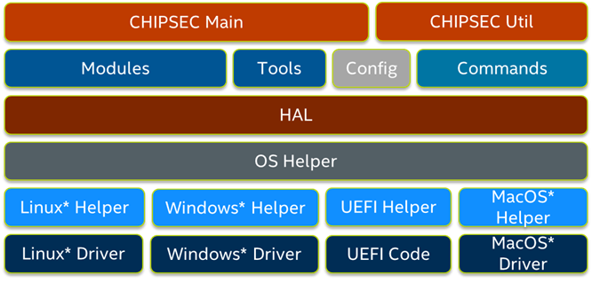

Architecture Overview
=====================

   CHIPSEC Architecture

Core components
---------------

    ===============================================  =================================================================================
    ``chipsec_main.py``                              main application logic and automation functions
    ``chipsec_util.py``                              utility functions (access to various hardware resources)
    ``chipsec/chipset.py``                           chipset detection
    ``chipsec/command.py``                           base class for util commands
    ``chipsec/defines.py``                           common defines
    ``chipsec/file.py``                              reading from/writing to files
    ``chipsec/logger.py``                            logging functions
    ``chipsec/module.py``                            generic functions to import and load modules
    ``chipsec/module_common.py``                     base class for modules
    ``chipsec/result_deltas.py``                     supports checking result deltas between test runs
    ``chipsec/testcase.py``                          support for XML and JSON log file output
    ``chipsec/helper/helpers.py``                    registry of supported OS helpers
    ``chipsec/helper/oshelper.py``                   OS helper: wrapper around platform specific code that invokes kernel driver
    ===============================================  =================================================================================

Commands
--------

Implement functionality of chipsec_util.

CHIPSEC utilities provide the capability for manual testing and direct hardware access.

.. warning:: DIRECT HARDWARE ACCESS PROVIDED BY THESE UTILITIES COULD MAKE YOUR SYSTEM UNBOOTABLE. MAKE SURE YOU KNOW WHAT YOU ARE DOING!

.. note:: All numeric values in the instructions are in hex.

.. toctree::

    List of Utility components <../modules/chipsec.utilcmd.rst>

HAL (Hardware Abstraction Layer)
--------------------------------

Useful abstractions for common tasks such as accessing the SPI.

.. toctree::

    List of HAL components <../modules/chipsec.hal.rst>

Fuzzing
-------

.. toctree::

    List of Fuzzing components <../modules/chipsec.fuzzing.rst>

CHIPSEC_MAIN Program Flow
-------------------------

1. Select :ref:`OS Helpers and Drivers <OS-Helpers-and-Drivers>`

   - Load Driver (optional)

2. :ref:`Detect Platform <Platform-Detection>`
3. Load :ref:`Configuration Files <Configuration-Files>`
4. Load Modules
5. Run Loaded Modules
6. Report Results
7. Cleanup

CHIPSEC_UTIL Program Flow
-------------------------

1. Select :ref:`OS Helpers and Drivers <OS-Helpers-and-Drivers>`

   - Load Driver (optional)

2. :ref:`Detect Platform <Platform-Detection>`
3. Load :ref:`Configuration Files <Configuration-Files>`
4. Load Utility Commands
5. Run Selected Command
6. Cleanup

Auxiliary components
--------------------

    - ``setup.py`` setup script to install CHIPSEC as a package

Executable build scripts
------------------------

    - ``<CHIPSEC_ROOT>/scripts/build_exe_*.py`` make files to build Windows executables