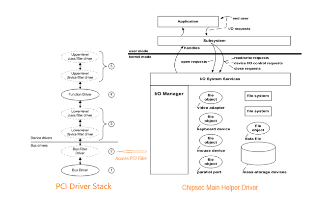
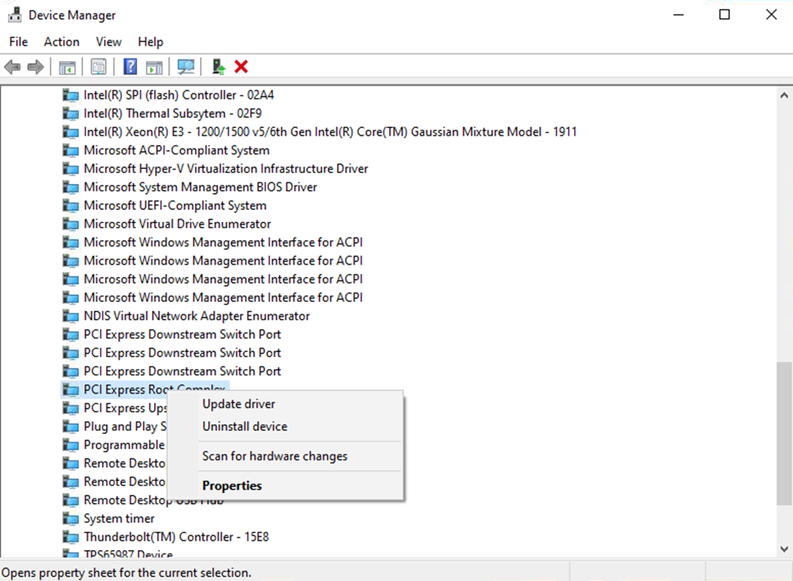

Windows Installation
====================

| CHIPSEC supports the following versions:
| Windows 8, 8.1, 10, 11 - x86 and AMD64
| Windows Server 2012, 2016, 2019, 2022, 2025 - x86 and AMD64

.. note::

   CHIPSEC has removed support for the RWEverything (https://rweverything.com/) driver due to PCI configuration space access issues.

Install CHIPSEC Dependencies
----------------------------

Python 3.8 or higher (https://www.python.org/downloads/)

.. note::

   CHIPSEC has deprecated support for Python2 since June 2020 

To install requirements: 

   `pip install -r windows_requirements.txt`

which includes:

   * `pywin32 <https://pypi.org/project/pywin32/#files>`_: for Windows API support (`pip install pywin32`)
   * `setuptools <https://pypi.org/project/setuptools/>`_ (`pip install setuptools`)
   * `WConio2 <https://pypi.org/project/WConio2/>`_: Optional. For colored console output (`pip install Wconio2`)

To compile the driver:

   `Visual Studio and WDK <https://docs.microsoft.com/en-us/windows-hardware/drivers/download-the-wdk>`_: for building the driver. 
   
   For best results use the latest available (**VS2022 + SDK/WDK 11** or **VS2019 + SDK/WDK 10 or 11**)
   
   .. note::

      Make sure to install compatible VS/SDK/WDK versions and the spectre mitigation packages

To clone the repo:

   `git <https://git-scm.com/>`_: open source distributed version control system

Building
--------

Clone CHIPSEC source

   ``git clone https://github.com/chipsec/chipsec.git``

Build the Driver and Compression Tools
   
   ``python setup.py build_ext -i``

.. note::

   If build errors are with signing are encountered, try running as Administrator
   The .vcxproj file points to the latest SDK, if this is incompatible with the WDK, change the configuration to a compatible SDK within the project properties

Turn off kernel driver signature checks
---------------------------------------

**Enable boot menu**

In CMD shell:
   
   ``bcdedit /set {bootmgr} displaybootmenu yes``

**With Secure Boot enabled:**

Method 1:

   - In CMD shell: ``shutdown /r /t 0 /o`` or Start button -> Power icon -> SHIFT key + Restart
   - Navigate: Troubleshooting -> Advanced Settings -> Startup Settings -> Reboot 
   - After reset choose F7 or 7 “Disable driver signature checks”

Method 2: 

   - Disable Secure Boot in the BIOS setup screen then disable driver signature checks as with Secure Boot disabled

**With Secure Boot disabled:**

Method 1: 

   - Boot in Test mode (allows self-signed certificates)
      - Start CMD.EXE as Adminstrator ``BcdEdit /set TESTSIGNING ON`` 
      - Reboot
      - If this doesn’t work, run these additional commands:
         - ``BcdEdit /set noIntegrityChecks ON``
         - ``BcdEdit /set loadoptions DDISABLE_INTEGRITY_CHECKS``

Method 2: 

   - Press F8 when booting Windows and choose “No driver signatures enforcement” option to turn off driver signature checks

Alternate Build Methods
-----------------------

**Build CHIPSEC kernel driver with Visual Studio**

Method 1:

   - Open the Visual Studio project file (drivers/windows/chipsec_hlpr.vcxproj) using Visual Studio
   - Select Platform and configuration (X86 or x64, Release)
   - Go to Build -> Build Solution

Method 2:

   - Open a VS developer command prompt
   - ``> cd <CHIPSEC_ROOT_DIR>\drivers\windows``
   - Build driver using msbuild command:
      - ``> msbuild /p:Platform=x64``

      or
      
      - ``> msbuild /p:Platform=x32``

If build process is completed without any errors, the driver binary will be moved into the chipsec helper directory: 
   
   ``<CHIPSEC_ROOT_DIR>\chipsec\helper\windows\windows_amd64 (or i386)``

**Build the compression tools**

Method:

   - Navigate to the chipsec_tools\compression directory   
   - Run `python setup.py build`
   - Copy the `EfiCompressor.cp<pyver>-win_<arch>.pyd` file from  build/lib.win-<arch>-<pyver> to the root chipsec directory

**Alternate Method to load CHIPSEC service/driver**

To create and start CHIPSEC service

   ``sc create chipsec binpath="<PATH_TO_SYS>" type= kernel DisplayName="Chipsec driver"``
   ``sc start chipsec``

When finished running CHIPSEC stop/delete service:

   ``sc stop chipsec``
   ``sc delete chipsec``

Windows PCI Filter Driver
-------------------------

**Filter driver background**

Since July 31, 2020 Microsoft has released Windows 2020-KB4568831 (OS Build 19041.423) Preview. Microsoft recommends to not access the PCI configuration space using the legacy API, as it might result in the Windows BSOD (Blue Screen of Death). The BSOD trigger condition is “Windows version >= (OS Build 19041.423) && Secure Devices (SDEV) ACPI table && VBS enabled”. Therefore, CHIPSEC now includes a PCI filter driver which supplements the original CHIPSEC Windows Driver to access the PCI configuration space. A system requires the PCI Filter Driver if the conditions above are met.

Windows devices that receive the 2020-KB4568831 (OS Build 19041.423) Preview or later updates restrict how processes
can access peripheral component interconnect (PCI) device configuration space if a Secure Devices (SDEV) ACPI table is present
and Virtualization-based Security (VBS) is running. Processes that have to access PCI device configuration space must use
officially supported mechanisms.The SDEV table defines secure hardware devices in ACPI. VBS is enabled on a system if security
features that use virtualization are enabled. Some examples of these features are Hypervisor Code Integrity or Windows Defender
Credential Guard. The new restrictions are designed to prevent malicious processes from modifying the configuration space of
secure devices. Device drivers or other system processes must not try to manipulate the configuration space of any PCI devices,
except by using the Microsoft-provided bus interfaces or IRP. If a process tries to access PCI configuration space in an unsupported
manner (such as by parsing MCFG table and mapping configuration space to virtual memory), Windows denies access to the process and
generates a Stop error. For more detail please refer below link: https://learn.microsoft.com/en-us/troubleshoot/windows-client/performance/stop-error-lenovo-thinkpad-kb4568831-uefi

**Filter Driver and Main Helper Driver Architecture**

   CHIPSEC Main & Filter Driver Architecture

Install PCI Filter Driver
-------------------------
**1. Locate the Filter Driver Files: chipsec/helper/windows/windows_amd64/**

.. figure:: ../_images/driver_files.png
   :alt: Check The Filter Driver Files
   :width: 920
   :height: 340

**2. Update The PCI Device Driver From Device Manager**

**3. Browse The PCI Filter Driver**

 .. figure:: ../_images/browse_driver.png
   :alt: Browse The PCI Filter Driver
   :width: 920
   :height: 630

**4. Manually Select The PCI Bus Filter Driver**

 .. figure:: ../_images/pickup_driver.png
   :alt: Pickup The PCI Filter Driver
   :width: 920
   :height: 630

**5. Install The Filter Driver From Disk**

 .. figure:: ../_images/install_driver_from_disk.png
   :alt: Install The Filter Driver From Disk
   :width: 920
   :height: 650

**6. Installing The Filter Driver**

 .. figure:: ../_images/installing_driver.png
   :alt: Installing The Filter Driver
   :width: 920
   :height: 650

**7. Finish The Filter Driver Installing**

 .. figure:: ../_images/installing_finished.png
   :alt: Finish The Filter Driver Installing
   :width: 920
   :height: 650

**8. Restart Computer**

 .. figure:: ../_images/restart.png
   :alt: Restart Computer
   :width: 920
   :height: 420

**9. Check The Installed Device Driver From Device Manager**

 .. figure:: ../_images/check_installed_driver.png
   :alt: Check The Installed Device Driver
   :width: 920
   :height: 650

**10. Check The Driver Device Info**

 .. figure:: ../_images/driver_dev_info.png
   :alt: Check The Driver Device Info
   :width: 700
   :height: 700

Filter Driver Access PCI Config Space Test
------------------------------------------
**Dump PCI Config Test**

 .. figure:: ../_images/pci_dump_test.png
   :alt: Dump PCI Config
   :width: 950
   :height: 900

   ``py chipsec_util.py pci dump 0 0 0``

**PCI Enumeration Test**
 .. figure:: ../_images/pci_enum_test.png
   :alt: PCI Enumeration Test
   :width: 850
   :height: 700

   ``py chipsec_util.py pci enumerate``

